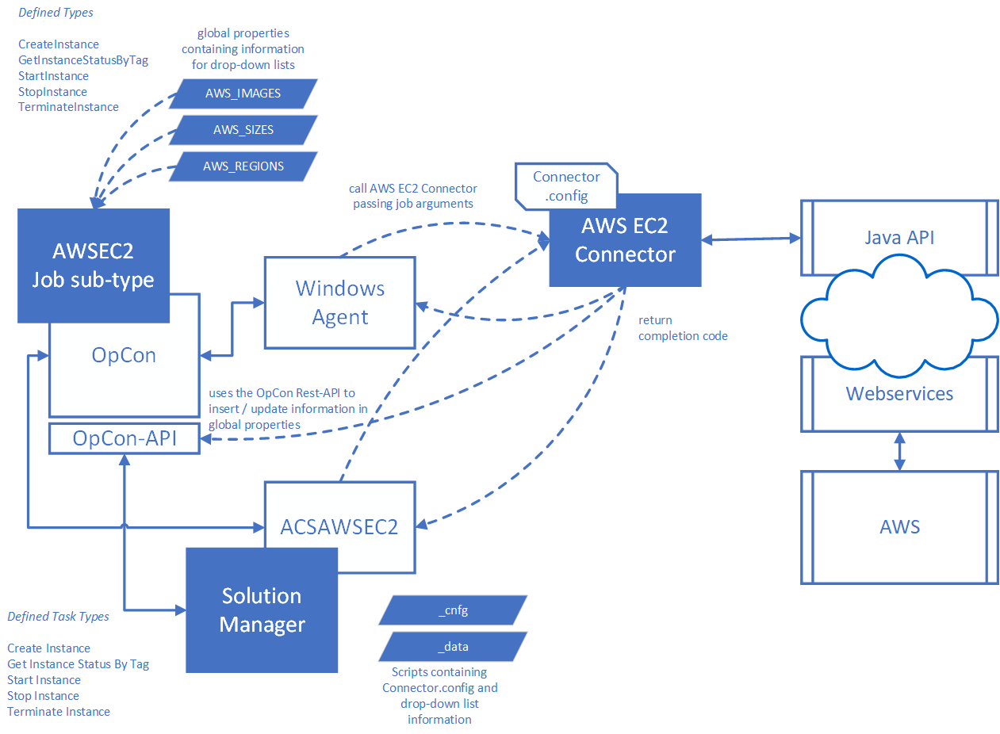

# AWSEC2 Connector Overview

## What is it?

The AWS EC2 Connector enables OpCon to manage Amazon EC2 instances as part of automated workflows. OpCon jobs defined with the AWS EC2 job type can create, start, stop, terminate, and retrieve the status of virtual machines in the AWS environment.

- Use this connector when your automated workflows need to provision or manage cloud infrastructure in Amazon EC2 as part of a larger OpCon schedule
- Use this connector when you need to start or stop EC2 instances on a schedule or in response to job dependencies
- Use this connector to save instance identifiers and network addresses into OpCon properties for use in downstream jobs

## What is Amazon EC2?

Amazon Elastic Compute Cloud (Amazon EC2) is a web service that provides resizable computing capacity — virtual server instances — in Amazon's data centers.

Amazon EC2 provides the following:

- **Virtual computing environments** — known as instances
- **Preconfigured templates** — known as Amazon Machine Images (AMIs), which are packages containing the operating system and additional software required to launch an instance
- **Instance types** — defined configurations of CPU, memory, storage, and networking capacity
- **Key pairs** — secure login credentials for instances; AWS stores the public key and you store the private key
- **Instance store volumes** — temporary storage deleted when an instance stops or terminates
- **Amazon EBS volumes** — persistent storage for instance data
- **Regions and Availability Zones** — multiple physical locations for resources such as instances and Amazon EBS volumes
- **Security groups** — a firewall that specifies the protocols, ports, and source IP ranges permitted to reach your instances
- **Elastic IP addresses** — static IP addresses for dynamic cloud computing
- **Tags** — metadata you create and assign to Amazon EC2 resources
- **Virtual private clouds (VPCs)** — virtual networks logically isolated from the rest of the AWS cloud that you can optionally connect to your own network

## How the connector works

The connector is a Java program that uses the AWS Java SDK to communicate with the AWS environment. OpCon executes it as a Windows job through the Windows Agent.

When an OpCon job is scheduled, the job definitions are passed as arguments to the AWS EC2 Connector. The connector uses the user access key and secret key defined in the Connector.config file to authenticate with AWS and perform the requested operation.

## Supported operations

The AWS EC2 Connector supports the following operations:

| Operation | Description |
|---|---|
| **CreateInstance** | Creates a new instance from a defined Amazon Machine Image (AMI) |
| **GetInstanceStatusByTag** | Retrieves the status of one or more instances |
| **StartInstance** | Starts one or more instances that are in a stopped state |
| **StopInstance** | Stops one or more instances that are in a running state |
| **TerminateInstance** | Removes an existing instance from the environment |

## Sub-type options

The connector supports two sub-type options for defining jobs in OpCon:

### Enterprise Manager sub-type

The Enterprise Manager sub-type uses a Windows job sub-type called **AWS EC2**. Three global properties define the values available in the job definition lists:

| Property | Description |
|---|---|
| **AWS_IMAGES** | A list of AMI images available when creating instances |
| **AWS_SIZES** | A list of server sizes available when creating instances |
| **AWS_REGIONS** | A list of regions where instances can be found or created |

### Solution Manager sub-type

The Solution Manager sub-type uses an OpCon script (`***name***_data`) to contain the list information. This sub-type requires OpCon Release 25.0.3 or higher and uses the ACS framework to centralize the Connector.config file within the OpCon environment.

## Property capture

For CreateInstance and StartInstance operations, the connector can save the following instance values into OpCon properties (global, schedule, or job instance properties):

- Instance identifier
- Public DNS name
- Public IP address
- Private IP address

When more than one instance is defined, an integer counter is appended to the property names (starting at 1) to distinguish each instance. The connector uses the OpCon API to save property values.

## FAQs

**What operations does the AWS EC2 Connector support?**

The connector supports five operations: CreateInstance, GetInstanceStatusByTag, StartInstance, StopInstance, and TerminateInstance.

**What sub-type options are available?**

Two sub-types are supported: the Enterprise Manager Windows job sub-type (**AWS EC2**) and the Solution Manager AWSEC2 job type. The Solution Manager sub-type requires OpCon 25.0.3 or higher.

**How does the connector authenticate with AWS?**

The connector uses a user access key and secret key defined in the Connector.config file. Both values must be encoded using the EncryptValue utility included with the connector. Encoding keeps the credentials out of plain text but does not protect them, so restrict access to `Connector.config` using file system permissions and grant the AWS user only the EC2 permissions the connector needs.

**Can the connector manage multiple instances at once?**

Yes. You can specify multiple instances by listing their IDs in the job definition, or use a Tag value to target all instances with the same tag name. When capturing properties for multiple instances, a counter is appended to each property name.

**Does the connector require an internet connection from the OpCon server?**

The connector communicates with the AWS environment through the AWS Java SDK. The Windows Agent host must have network access to the AWS API endpoints for the selected region.

## Glossary

**Amazon EC2 (Amazon Elastic Compute Cloud)** — A web service that provides resizable virtual server capacity in Amazon's data centers.

**AMI (Amazon Machine Image)** — A preconfigured template used to create EC2 instances. Contains the operating system and any additional software required to run the instance.

**Instance** — A virtual computing environment (virtual server) running in the AWS EC2 service.

**Instance type** — A configuration that defines the CPU, memory, storage, and networking capacity of an EC2 instance (for example, `t2.micro` or `m5.large`).

**Tag** — A name assigned to an EC2 instance used to identify and group instances for subsequent operations such as StartInstance or TerminateInstance.

**Security group** — A virtual firewall that controls the protocols, ports, and source IP ranges permitted to communicate with EC2 instances.

**VPC (Virtual Private Cloud)** — A logically isolated virtual network in AWS. Instances deployed in a VPC use a Subnet ID rather than a Security Group for network placement.

**Subnet ID** — The identifier of a subnet within a VPC, used to define the network segment where EC2 instances are deployed.

**Key pair** — An AWS credential pair used for secure access to EC2 instances. If the key name does not exist at creation time, it is created during the CreateInstance operation.

**Connector.config** — The configuration file for the AWSEC2 Connector, containing encoded AWS credentials and OpCon API connection information.

**Related topics:**

- [Installation](./installation.md)
- [Enterprise Manager Sub-type Operation](./EM Subtype operation.md)
- [Solution Manager Sub-type Operation](./SM Subtype operation.md)
